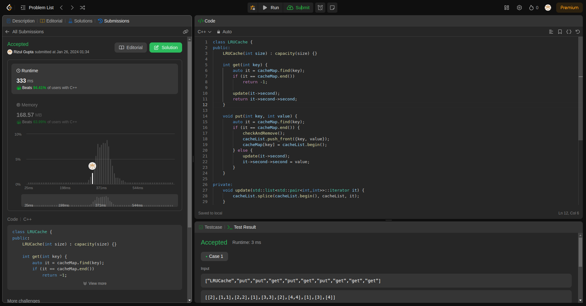

## Question-2 (Implement LRU Cache)

- **Submission Link:** [LeetCode Submission](https://leetcode.com/problems/lru-cache/submissions/1156809008)
- **Status:** Passed all test cases
- **Time Complexity:**Both the put and get functions have constant time complexity, O(1), under average conditions. This is because the hash map provides constant-time average-case performance for insertions, deletions, and lookups, and the doubly linked list operations also have constant-time complexity. However, it's important to note that the worst-case time complexity of hash map operations could be O(n) if there are many collisions, but this is rare and typically not a concern in practice.
- **Space Complexity:** O(n)(where n is the number of key-value pairs stored in the map)
- **Explanation:** The `put` function in the LRUCache class is responsible for adding or updating key-value pairs. It first checks if the key already exists in the cache, and if not, it removes the least recently used key-value pair if the cache has reached its capacity limit. Then, it adds the new key-value pair to the front of the cache and updates the corresponding mapping in the hash map. If the key already exists, it updates the value associated with the key and moves the key-value pair to the front of the cache to indicate recent usage.
  Similarly, the `get` function retrieves the value associated with a given key from the LRUCache. It checks if the key exists in the cache, and if found, retrieves the corresponding value and moves the key-value pair to the front of the cache to indicate recent usage. If the key is not found, it returns -1 to indicate that the key is not present in the LRUCache. Both functions ensure that the most recently used key-value pairs are readily accessible and adhere to the LRU (Least Recently Used) eviction policy of the cache.
  
