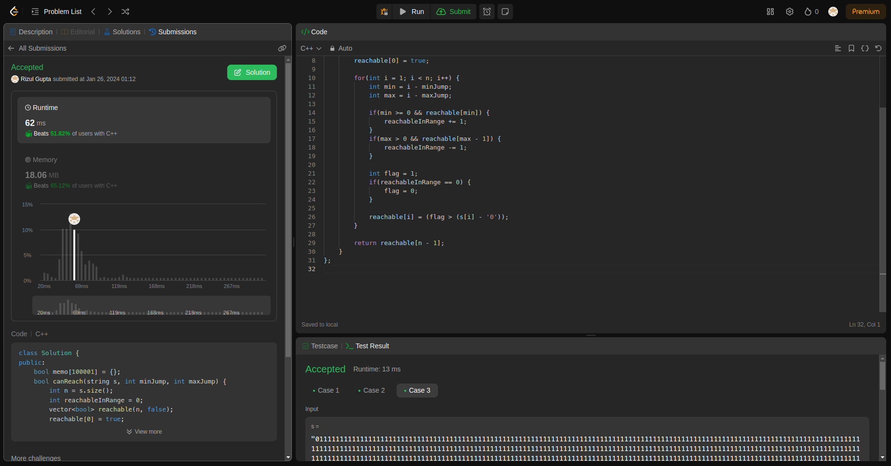

## Question-4 (Jump Game VII)

- **Submission Link:** [LeetCode Submission](https://leetcode.com/problems/jump-game-vii/submissions/1156794155)
- **Status:** Passed all test cases
- **Time Complexity:** O(n) (where n is length of string)
- **Space Complexity:** O(n) (where n is length of string)
- **Explanation:** The provided C++ code defines a class `Solution` with a member function `canReach` designed to determine whether it's possible to traverse from the beginning to the end of a given string `s` under specific constraints of minimum and maximum jumps. Within the function, it iterates through the string, tracking the reachable positions within the range defined by `minJump` and `maxJump`. For each position, it updates the count of reachable positions and evaluates whether the current position is reachable based on the conditions. The function ultimately returns a boolean indicating whether it's feasible to reach the end of the string. This approach utilizes dynamic programming techniques to efficiently compute the reachability of positions along the string.
  
