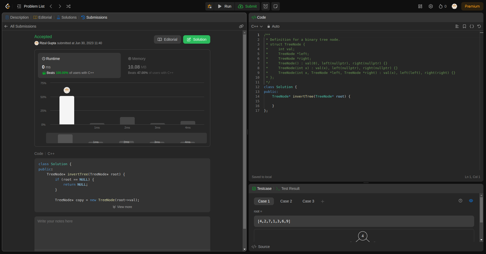

# DSA Assignment-2

## Question-1 (Invert Binary Tree)

- **Submission Link:** [LeetCode Submission](https://leetcode.com/problems/invert-binary-tree/submissions/982845364/)
- **Status:** Passed all test cases
- **Time Complexity:** O(n) (where n is number of nodes in tree)
- **Space Complexity:** O(n) (for function call stack space)
- **Explanation:** This code defines a function called `invertTree` that takes a TreeNode pointer `root` as input and returns another TreeNode pointer. It recursively traverses the binary tree starting from the root node. At each node, it creates a new node called `copy` with the same value as the current node. Then, it recursively calls `invertTree` on the right and left children of the current node, assigning the inverted left child to the `copy`'s right pointer and the inverted right child to the `copy`'s left pointer. Finally, it returns the `copy` node, effectively returning a new binary tree with all its nodes inverted.
  

## Question-2 (Implement LRU Cache)

- **Submission Link:** [LeetCode Submission](https://leetcode.com/problems/lru-cache/submissions/1156809008)
- **Status:** Passed all test cases
- **Time Complexity:**Both the put and get functions have constant time complexity, O(1), under average conditions. This is because the hash map provides constant-time average-case performance for insertions, deletions, and lookups, and the doubly linked list operations also have constant-time complexity. However, it's important to note that the worst-case time complexity of hash map operations could be O(n) if there are many collisions, but this is rare and typically not a concern in practice.
- **Space Complexity:** O(n)(where n is the number of key-value pairs stored in the map)
- **Explanation:** The `put` function in the LRUCache class is responsible for adding or updating key-value pairs. It first checks if the key already exists in the cache, and if not, it removes the least recently used key-value pair if the cache has reached its capacity limit. Then, it adds the new key-value pair to the front of the cache and updates the corresponding mapping in the hash map. If the key already exists, it updates the value associated with the key and moves the key-value pair to the front of the cache to indicate recent usage.
  Similarly, the `get` function retrieves the value associated with a given key from the LRUCache. It checks if the key exists in the cache, and if found, retrieves the corresponding value and moves the key-value pair to the front of the cache to indicate recent usage. If the key is not found, it returns -1 to indicate that the key is not present in the LRUCache. Both functions ensure that the most recently used key-value pairs are readily accessible and adhere to the LRU (Least Recently Used) eviction policy of the cache.
  

## Question-3 (Validate Binary Search Tree)

- **Submission Link:** [LeetCode Submission](https://leetcode.com/problems/validate-binary-search-tree/submissions/1003797100/)
- **Status:** Passed all test cases
- **Time Complexity:** O(n) (where n is number of nodes in tree)
- **Space Complexity:** O(n)
- **Explanation:** It verifies if the given tree is binary tree is BST by recursively traversing the tree in an in-order manner, keeping track of the values encountered in a vector. At each node, it verifies if the current value is greater than the last value encountered, ensuring the BST property.
  

## Question-4 (Jump Game VII)

- **Submission Link:** [LeetCode Submission](https://leetcode.com/problems/jump-game-vii/submissions/1156794155)
- **Status:** Passed all test cases
- **Time Complexity:** O(n) (where n is length of string)
- **Space Complexity:** O(n) (where n is length of string)
- **Explanation:** The provided C++ code defines a class `Solution` with a member function `canReach` designed to determine whether it's possible to traverse from the beginning to the end of a given string `s` under specific constraints of minimum and maximum jumps. Within the function, it iterates through the string, tracking the reachable positions within the range defined by `minJump` and `maxJump`. For each position, it updates the count of reachable positions and evaluates whether the current position is reachable based on the conditions. The function ultimately returns a boolean indicating whether it's feasible to reach the end of the string. This approach utilizes dynamic programming techniques to efficiently compute the reachability of positions along the string.
  

## Question-5 (Find index of first occurence of string in a string)

### using Hashing: Rabin-Karp

- **Submission Link:** [LeetCode Submission](https://leetcode.com/problems/find-the-index-of-the-first-occurrence-in-a-string/submissions/1156634026)
- **Status:** Passed all test cases
- **Time Complexity:** O(m+n) (in average and best case time-complexity) and O(mn) (in worst case time-complexity)
- **Space Complexity:** O(1)
- **Explanation:** The submitted code works by calculating hash values for both the needle and successive windows of the haystack. These hash values are compared, and if they match, further verification is done by comparing the actual characters. This approach allows for faster identification of potential matches. As the algorithm progresses through the haystack, it updates the hash values using a rolling hash technique, which involves subtracting the contribution of the first character in the previous window and adding the contribution of the next character in the current window. By leveraging hashing and rolling hash calculations, the Rabin-Karp algorithm offers an efficient solution for substring search tasks.
  
